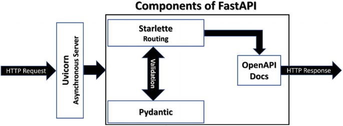
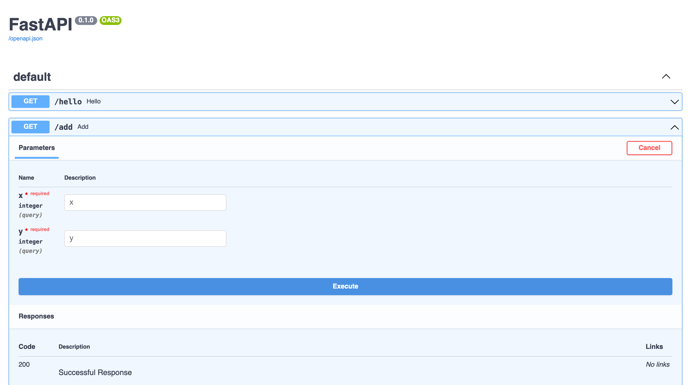
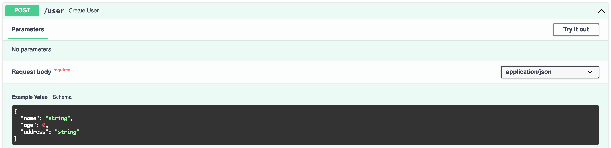
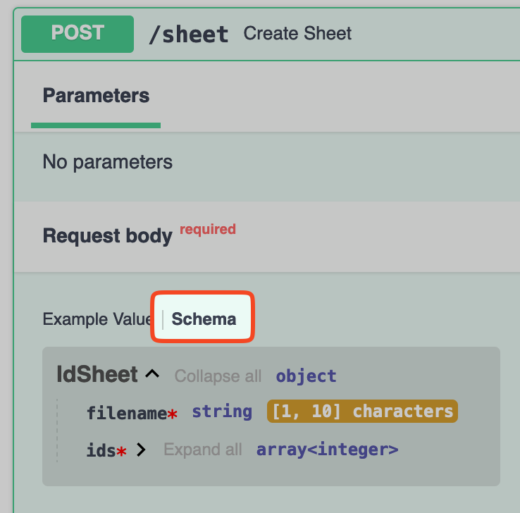
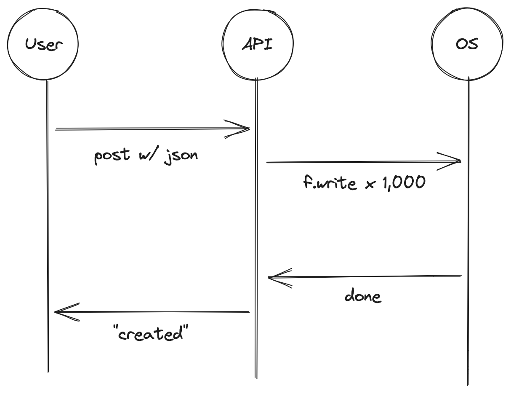
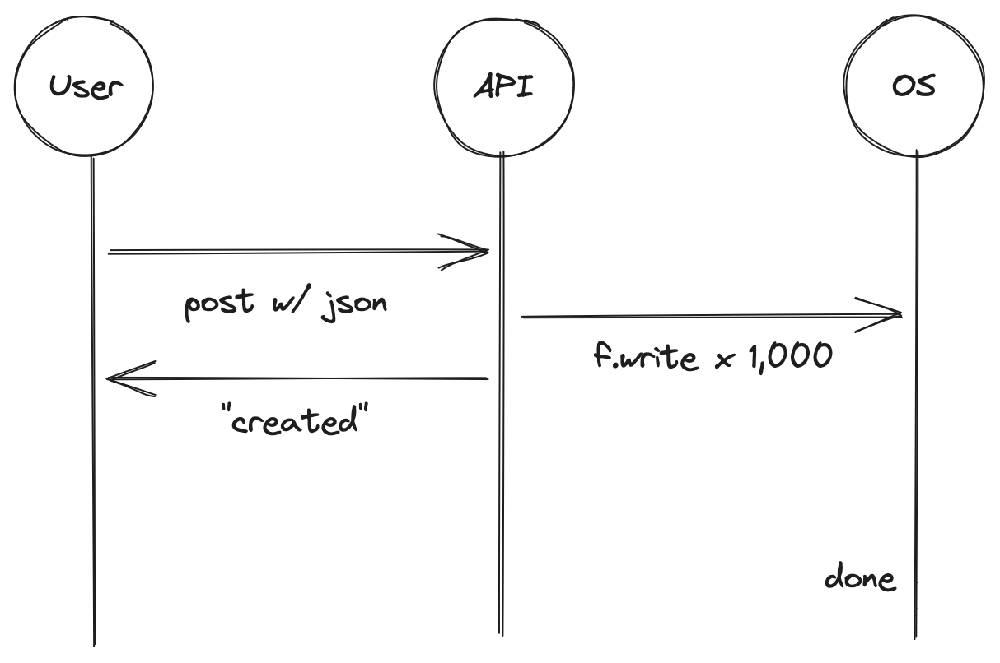

# 접속 주소: https://bit.ly/pycon-2023-fastapi

---

# 1. FastAPI 기초 핸즈온

- 첫 시간에는 FastAPI에 대해 기초적인 내용을 살펴보고 간단한 API 엔드포인트를 만들어 봅니다.
- 첫 시간이 끝나면 간단한 FastAPI 프로젝트를 구성할 수 있을 겁니다.

## FastAPI 개요와 기본 구성 요소


- FastAPI는 Pydantic과 Starlette, Uvicorn을 기반으로 만들어진 웹 프레임워크



- Uvicorn이 요청을 받으면 
- Starlette이 라우팅을 처리하고
- Pydantic이 데이터를 검증

#### 파이썬 버전 확인

```shell
$ python --version
Python 3.11.0
```

(파이썬 3.10보다 낮은 버전이라면 3.10 이상 버전을 설치해주세요.)

#### Poetry(의존성 라이브러리를 관리하는 도구) 설치

```shell
$ pip install poetry
$ poetry --version
Poetry (version 1.5.1)
```

(Poetry도 최신 버전이 좋겠어요.)

- Poetry에 대해 더 알고 싶다면
  - [파이썬을 처음 사용하는 동료와 효율적으로 일하는 방법](https://medium.com/daangn/%ED%8C%8C%EC%9D%B4%EC%8D%AC%EC%9D%84-%EC%B2%98%EC%9D%8C-%EC%82%AC%EC%9A%A9%ED%95%98%EB%8A%94-%EB%8F%99%EB%A3%8C%EC%99%80-%ED%9A%A8%EC%9C%A8%EC%A0%81%EC%9C%BC%EB%A1%9C-%EC%9D%BC%ED%95%98%EB%8A%94-%EB%B0%A9%EB%B2%95-bb52c3a433fa)
  - 같은 제목의 [파이콘 2023 발표](https://2023.pycon.kr/session/18)


- 필요한 Git 저장소 복제

```shell
$ git clone ...
$ cd fastapi-tutorial-at-pyconkr-2023
```

- 의존성 설치

```shell
$ poetry install
...
```

## FastAPI 프로젝트 구조 및 파일 구성

```shell
$ tree
.
├── api
│   └── api.py
├── poetry.lock
├── poetry.toml
└── pyproject.toml
```

## 간단한 API 엔드포인트 만들기

#### `api/api.py` 파일 작성

```python
# api/api.py
from fastapi import FastAPI

app = FastAPI()


@app.get("/hello")
def hello() -> dict:
    return {"message": "Hello World"}
```

#### FastAPI 서버 실행하기

```shell
$ poetry run uvicorn api.api:app --reload
```

- 브라우저에서 http://localhost:8000/hello 확인하기
- api.api:app은 `api/api.py` 파일에 있는 `app` 객체를 실행한다는 의미입니다.
- `--reload` 옵션이 있으면 코드가 변경될 때 자동으로 서버를 재시작해줍니다.

```json
{"message": "Hello World"}
```

## 쿼리 파라미터 받아서 응답하기

#### `api/api.py` 파일에 내용 추가

```python
@app.get("/add")
def add(x, y):
    return {"result": x + y}
```

이제 FastAPI 서버를 실행하고,

```shell
$ poetry run uvicorn api.api:app --reload
```

- 브라우저에서 http://localhost:8000/add?x=1&y=2 확인하기

```json
{"result": 12}
```

#### 실습: `result` 고치기

(FastAPI를 모르는 경우를 가정하고) 파이썬에서 문자열을 숫자로 형변환하는 방법을 사용해보세요.

<details>
<summary>답</summary>

```python
@app.get("/add")
def add(x, y):
    return {"result": int(x) + int(y)}
```
</details>

#### 실습: multiply API 만들어보기

아래 코드의 `...` 부분을 채워서 multiply API를 완성하기

```python
@app.get("/multiply")
def multiply(...):
    return {"result": ...}
```

<details>
<summary>답</summary>

```python
@app.get("/multiply")
def multiply(x, y):
    return {"result": int(x) * int(y)}
```

- 작동 확인 http://localhost:8000/multiply?x=1&y=2
</details>


## 경로 파라미터 받아서 응답하기

#### `api/api.py` 파일 수정하기

```python
# @app.get("/hello") 부분을 아래처럼 수정
@app.get("/hello/{name}")
def hello(name):
    return {"message": f"Hello {name}"}
```

- 브라우저에서 http://localhost:8000/hello/pycon

```json
{"message": "Hello pycon"}
```

#### 실습: multiply API가 경로 파라미터를 받도록 바꿔보기

<details>
<summary>답</summary>

```python
@app.get("/multiply/{x}/{y}")
def multiply(x, y):
    return {"result": int(x) * int(y)}
```

- 작동 확인 http://localhost:8000/multiply/1/2
</details>


## OpenAPI(Swagger) 문서 확인하기

FastAPI가 자동으로 만들어주는 문서 http://localhost:8000/docs

## 데모: OpenAPI 문서로 Client용 TypeScript 코드 생성하기

- https://editor.swagger.io/ 에서 `openapi.json` 파일을 열고
- `Generate Client -> typescript-fetch` 선택한 후
- 다운로드한 파일 중 `api.ts` 파일을 열어보면...

#### 각 API의 상세 정보를 확인하고, 브라우저에서 직접 실행(Try it out) 해보기



---

# 2. FastAPI의 데이터 검증 feat. Pydantic

- 둘째 시간에는 FastAPI의 데이터 검증 기능을 다룹니다.
- 둘째 시간이 끝나면 입력 값을 검증하는 API를 만들 수 있을 겁니다.


## 타입 힌트 추가하기

#### 간단히 알아보는 파이썬의 타입 힌팅

```python
name: str = 'pycon'  # 변수에 타입 힌트 추가 (타입 강제가 아님에 유의!)

some_value: int | str  # int형이나 str형이 될 수 있음을 표시

def hello(name: str = 'default name') -> dict:  # 함수의 인자와 리턴값에 타입 힌트 추가
    return {'result': f'Hello {name}'}
```

#### `api/api.py` 파일의 `add`, `multiply` 함수에 타입 힌팅 추가하기

```python
@app.get("/add")
def add(x: int, y: int) -> dict:
    return {"result": x + y}

@app.get("/multiply/{x}/{y}")
def multiply(x: int, y: int) -> dict:
    return {"result": x * y}
```

- 형변환 부분을 제거했지만 `x`와 `y`를 `int` 형으로 인식합니다.

## FastAPI의 자동화된 오류 코드

- FastAPI는 파이썬의 타입 힌팅을 기반으로 파라미터의 타입을 검사합니다.

#### 쿼리 파라미터의 타입이 맞지 않을 때

- 브라우저에서 http://localhost:8000/add?x=1&y=blah

```json
{
  "detail":[
    {
      "type":"int_parsing",
      "loc":["query","y"],
      "msg":"Input should be a valid integer, unable to parse string as an integer",
      "input":"blah",
      "url":"https://errors.pydantic.dev/2.1/v/int_parsing"
    }
  ]
}
```

#### 패스 파라미터의 타입이 맞지 않을 때

- 브라우저에서 http://localhost:8000/multiply/1/foo

```json
{
  "detail":[
    {
      "type":"int_parsing",
      "loc":["path","y"],
      "msg":"Input should be a valid integer, unable to parse string as an integer",
      "input":"foo",
      "url":"https://errors.pydantic.dev/2.1/v/int_parsing"
    }
  ]
}
```

## Query와 Body 다양하게 사용하기

#### add API의 `y` 인자에 기본값 추가하기

```python
@app.get("/add")
def add(x: int, y: int = 10) -> dict:
    return {"result": x + y}
```

- 브라우저에서 http://127.0.0.1:8000/add?x=1

```json
{"result": 11}
```

#### hello API에 옵셔널한 인자 추가하기

```python
from typing import Optional

@app.get("/hello/{name}")
def hello(name: str, nickname: str = None) -> dict:
    if nickname:
        return {"message": f"Hello {name} ({nickname})"}

    return {"message": f"Hello {name}"}
```

- 브라우저에서 http://127.0.0.1:8000/hello/myname?nickname=aaa 와 http://127.0.0.1:8000/hello/myname 의 차이 확인하기

#### 생각해보기: `nickname`의 기본 값을 `None`으로 설정하지 않고 `nickname`의 타입을 `str | None`으로 설정하면 어떨까요?

다음 코드도 직접 실행해보세요!

```python
# nickname의 타입을 str | None으로 설정한 경우
@app.get("/hello/{name}")
def hello(name: str, nickname: str | None) -> dict:
    if nickname:
        return {"message": f"Hello {name} ({nickname})"}
    
    return {"message": f"Hello {name}"}
```
<details>
<summary>답</summary>
`nickname`의 타입을 `str | None`으로 설정하더라도, FastAPI는 `nickname`의 기본 값을 `None`으로 설정하지 않습니다.

즉, `nickname`은 반드시 입력해야만 하는 필수 인자가 됩니다.
</details>

#### `hello` API의 `nickname` 인자에 복잡한 제한 추가하기

```python
# 파일 상단에 추가
from typing import Annotated
from fastapi import Query

# hello API 수정
@app.get("/hello/{name}")
def hello(
    name: str, 
    nickname: Annotated[str, Query(..., min_length=2, max_length=10)]
) -> dict:
    if nickname:
        return {"message": f"Hello {name} ({nickname})"}

    return {"message": f"Hello {name}"}
```

- typing 모듈의 `Annotated`는 파이썬의 타입 힌팅을 사용하여 변수에 제한을 추가할 수 있는 도구입니다.
- FastAPI에서는 `Annotated` 내부의 제한 사항을 분석하여 API에 반영합니다. 
- 브라우저에서 http://127.0.0.1:8000/hello/myname?nickname=a 와 http://127.0.0.1:8000/hello/myname?nickname=morethanten 확인하기

#### 실습: add API의 `x` 인자와 `y` 인자가 0 이상, 100 미만이도록 수정하기

- int형 파라미터에 사용할 수 있는 검증 도구
  - ge: 이상
  - gt: 초과
  - le: 이하
  - lt: 미만

<details>
<summary>답</summary>

```python
@app.get("/add")
def add(
    x: Annotated[int, Query(..., ge=0, lt=100)], 
    y: Annotated[int, Query(..., ge=0, lt=100)]
) -> dict:
    return {"result": x + y}
```

- 작동 확인 http://localhost:8000/add?x=100&y=-1
```json
{
  "detail": [
    {
      "type": "less_than",
      "loc": [
        "query",
        "x"
      ],
      "msg": "Input should be less than 100",
      "input": "100",
      "ctx": {
        "lt": 100
      },
      "url": "https://errors.pydantic.dev/2.1/v/less_than"
    },
    {
      "type": "greater_than_equal",
      "loc": [
        "query",
        "y"
      ],
      "msg": "Input should be greater than or equal to 0",
      "input": "-1",
      "ctx": {
        "ge": 0
      },
      "url": "https://errors.pydantic.dev/2.1/v/greater_than_equal"
    }
  ]
}
```
</details>

---

# 3. FastAPI의 데이터 검증 #2 feat. Pydantic의 `BaseModel`

- 셋째 시간에는 Pydantic의 `BaseModel`을 활용한 데이터 검증 기능을 다룹니다.
- (부록으로 응답 코드와 응답 데이터 형태를 변경하는 방법도 다룹니다.)
- 셋째 시간이 끝나면 복잡한 입력 값도 검증하는 API를 만들 수 있을 겁니다.

## 복잡한 요청 검증하기

#### POST 요청 처리하기

```python
@app.post("/user")
def create_user(name: str, age: int, address: str) -> dict:
    return {"name": name}
```

#### 파라미터를 `json` 형태로 입력받아 응답하는 API

```python
from pydantic import BaseModel

class User(BaseModel):
    name: str
    age: int
    address: str

@app.post("/user")
def create_user(user: User) -> dict:
    return {"name": user.name}
```

- 브라우저에서 http://localhost:8000/docs 를 열고 `/user` API 부분 확인하기



#### 실습: 목록형 변수 처리하기

- `create_user` API에서 친구 이름(`friend_names`) 목록을 입력 받고, 입력 받은 친구 이름 목록을 그대로 응답하는 API를 만들어보세요.

<details>
<summary>답</summary>

```python
class User(BaseModel):
    name: str
    age: int
    address: str
    friend_names: list[str]

@app.post("/user")
def create_user(user: User) -> dict:
    return {
        "name": user.name,
        
    }
```

- 작동 확인: http://localhost:8000/docs 를 열고 `/user` API에서 `Try it out` 버튼을 눌러 테스트해보기
</details>

## 응답 코드 변경하기

```python
# @app.post("/user") 부분을 다음과 같이 수정
@app.post("/user", status_code=201)
def create_user(user: User) -> dict:
    ...
```

- 브라우저에서 http://127.0.0.1:8000/docs 열고 `/user` API에 POST 요청 보내서 응답 코드 확인하기
- HTTP의 다양한 응답 코드에 대해서는 [HTTP 상태 코드](https://developer.mozilla.org/ko/docs/Web/HTTP/Status) 문서를 참고하세요

#### 파일명(`filename`)과 ID 목록(`ids`)을 입력받아 파일로 저장하는 API

```python
class IdSheet(BaseModel):
    filename: str
    ids: list[int]

@app.post("/sheet")
def create_sheet(sheet: IdSheet) -> dict:
    with open(sheet.filename, 'w') as f:
        f.write('id\n')

        for id in sheet.ids:
            f.write(f'{id}\n')

    return {"message": "created"}
```

#### `filename` 길이 제한하기

```python
from pydantic import Field

class IdSheet(BaseModel):
    filename: str = Field(min_length=1, max_length=10)
    ids: list[int]
```

- 브라우저에서 http://localhost:8000/docs 를 열고 `/sheet` API 부분 확인하기



#### `ids`에 제한 추가하기

```python
from pydantic import field_validator

class IdSheet(BaseModel):
    filename: str = Field(min_length=1, max_length=10)
    ids: list[int]

    @field_validator('ids')
    def check_ids(cls, ids):
        for id in ids:
            if id <= 0:
                raise ValueError('id는 0보다 커야 해요')

        return ids
```

- `ids`에 0 이하의 값 넣은 후 요청 보내서 응답 확인하기

#### 실습: `ids`에서 중복 `id` 제거하기

<details>
<summary>답</summary>

```python
class IdSheet(BaseModel):
    # ...

    @validator('ids')
    def check_ids(cls, ids):
        for id in ids:
            if id <= 0:
                raise ValueError('id는 0보다 커야 해요')

        return set(ids)
```

- 확인: `ids`에 중복되는 값 넣은 후 요청 보내고 `test.csv` 확인해보기
</details>

## (부록) 응답 데이터 타입 변경하기

```python
class CreateSheetResponse(BaseModel):
    message: str

# @app.post("/sheet") 부분을 다음과 같이 수정
@app.post("/sheet", status_code=201, response_model=CreateSheetResponse)
async def create_sheet(sheet: IdSheet) -> dict:
    ...
```

- 브라우저에서 http://127.0.0.1:8001/docs 의 Responses 부분이 어떻게 바뀌었는지 확인하기

---

# 4. FastAPI의 비동기 경험하기

- 넷째 시간에는 FastAPI의 대표적인 특징인 비동기 처리를 다뤄봅니다.
- 넷째 시간이 끝나면 비동기 요청을 다룰 수 있을 겁니다.

## 비동기 처리하기

#### `sheet` API에 `ids` 항목이 10억개라면?

동기 방식



비동기 방식



- 코드가 오래 걸리게 수정하기

```python
# 동기 방식에서 시간이 얼마나 걸리는지 확인해요
import time


@app.post("/sheet", status_code=201, response_model=CreateSheetResponse)
async def create_sheet(sheet: IdSheet) -> dict:  # 앞에 async를 추가했어요!
    start = time.time()
    with open(sheet.filename, 'w') as f:
        f.write('id\n')

        for id in sheet.ids:
            time.sleep(1)
            f.write(f'{id}\n')
    end = time.time() - start
    return {"message": f"created in {end:.2f}s"}
```

- `ids` 항목을 10개 정도 넣어서 요청 보내기

#### 비동기 코드로 수정하기

```python
# 비동기 방식에서 시간이 얼마나 걸리는지 확인해요
import asyncio
import aiofiles


@app.post("/sheet", status_code=201, response_model=CreateSheetResponse)
async def create_sheet(sheet: IdSheet) -> dict:
    start = time.time()
    async with aiofiles.open(sheet.filename, 'w') as f:
        await f.write('id\n')

        for id in sheet.ids:
            asyncio.sleep(1)
            await f.write(f'{id}\n')
    end = time.time() - start
    return {"message": f"created in {end:.2f}s"}
```

- 생각해보기: add나 multiply API에서 계산을 오래 한다고 가정해봅시다. 이런 경우에도 비동기로 처리하는 것이 좋을까요? 답을 했다면 왜 그런지도 생각해보세요.

<details>
<summary>답</summary>

- add나 multiply API에서는 계산 결과를 응답해야 합니다. 계산에 시간이 오래 걸린다고 해서 비동기로 처리한다면 계산 결과가 나오기도 전에 응답이 되어버리겠죠. (응답 값이 없어서 오류가 발생할 테지만요.)

- 정말로 계산 과정을 비동기로 처리하고 싶다면, 계산 결과를 DB나 파일에 저장하고 응답은 바로 해줄 수 있겠습니다. (이 경우 계산 결과를 읽어 올 수 있는 다른 API가 필요하겠지요.)
</details>

# FastAPI 자료

- [공식 문서](https://fastapi.tiangolo.com/)
